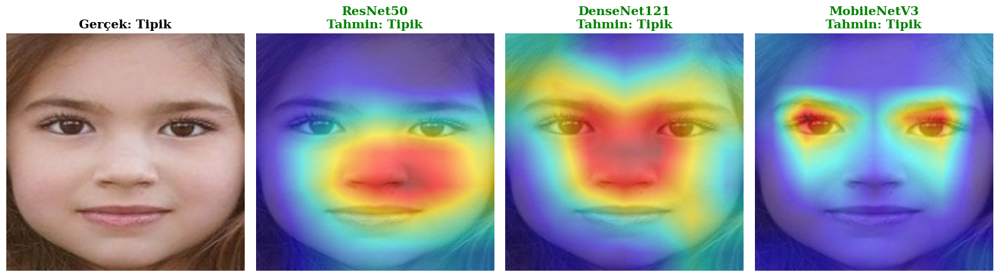
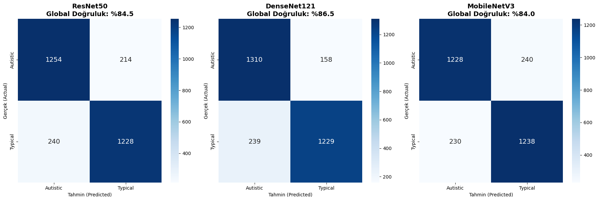

# Autism Face Classification with Deep Learning

<p align="center">
  
</p>

This repository presents a **complete, end-to-end deep learning pipeline** for **binary classification of facial images** related to **Autism Spectrum Disorder (ASD)**.  
The project emphasizes **clean engineering**, **reproducibility**, **data-leakage–safe evaluation**, and **explainability**, making it suitable for both **academic research** and **professional portfolios**.

---

## 🔍 Problem Overview

Autism Spectrum Disorder (ASD) is a neurodevelopmental condition that can affect social interaction and communication.  
Early detection plays a crucial role in intervention strategies.

This project investigates whether **convolutional neural networks (CNNs)** can learn discriminative facial features to distinguish between:
- **ASD (Autistic)**
- **TD (Typically Developing)**

from static facial images.

---

> ⚠️ This project is **research-oriented** and **not intended for clinical diagnosis**.

---

## 🧠 Methodology

### Model Architectures
ImageNet-pretrained CNN backbones are employed:

- **ResNet50**
- **DenseNet121**
- **MobileNetV3-Small**

A **model factory pattern** enables seamless architecture switching.

### Training Strategy
- Transfer learning
- Optional backbone freezing (feature extraction vs full fine-tuning)
- **Physical K-Fold Cross-Validation (K = 5)**  
  - Each fold is stored in **separate directories**
  - Guarantees **zero data leakage** between train and validation sets

### Data Augmentation
Implemented using **Albumentations**:

- Resize
- Horizontal flip
- Small rotations
- Brightness & contrast adjustment
- ImageNet normalization

---

## 📁 Dataset Organization

The dataset is **not included** due to privacy and licensing constraints.

Expected structure:

```
data/autism_unified_kfold/
  fold_1/
    train/
      autistic/
      typical/
    val/
      autistic/
      typical/
  fold_2/
  ...
```

> Physical fold separation is intentionally used instead of logical splits.

---

## 📊 Quantitative Results

### 5-Fold Cross-Validation Summary(DenseNet121)

| Metric    | Mean ± Std (%) |
|-----------|----------------|
| Accuracy  | **86.48 ± 2.48** |
| Precision | **86.70 ± 2.29** |
| Recall    | **86.48 ± 2.48** |
| F1-score  | **86.45 ± 2.51** |

> Metrics are **macro-averaged** and computed on validation sets only.

---

### Confusion Matrix (Example Fold)

<p align="center">
  
</p>

The confusion matrix highlights class-wise performance and common misclassification patterns.

---

## 🧪 Explainability — Grad-CAM

To improve interpretability, **Grad-CAM** is used to visualize spatial regions that most influence model predictions.

<p align="center">
  
</p>

This confirms that the network focuses on **meaningful facial regions**, rather than background artifacts.

---

## 📈 Training & Evaluation Pipeline

**Pipeline highlights:**
- Centralized configuration system
- Deterministic training via fixed seeds
- Automatic checkpointing (best validation loss)
- JSON-based experiment logging
- Script-based execution (no notebook dependency)

---

## 🚀 How to Run

### 1️⃣ Install Dependencies
```bash
pip install -r requirements.txt
```

### 2️⃣ Train (Physical K-Fold)
```bash
python scripts/train.py   --data_dir ./data/autism_unified_kfold   --model resnet50   --epochs 30   --batch 32
```

Outputs:
- `saved_models/` → fold-wise checkpoints
- `outputs/` → logs, summaries, metrics

---

### 3️⃣ Evaluate a Trained Model
```bash
python scripts/eval.py   --data ./data/autism_unified_kfold/fold_1/val   --model resnet50   --weights ./saved_models/resnet50_fold1.pth   --out ./outputs/eval_fold1
```

Exports:
- `metrics.json`
- `confusion_matrix.png`

---

## 📓 Notebooks

Purpose-specific notebooks only (no core logic):

- **01_colab_runner.ipynb** — Minimal Colab execution
- **02_gradcam.ipynb** — Grad-CAM visualization

---

## 🛠️ Project Structure

```
src/
  config.py        # Experiment configuration
  dataset.py       # Dataset & augmentation pipeline
  models.py        # CNN model factory
  train.py         # K-Fold training engine
  eval.py          # Evaluation & reporting
  utils.py         # Utilities (seed, metrics)

scripts/
  train.py         # Training entrypoint
  eval.py          # Evaluation entrypoint
```

---

## ⚠️ Reproducibility Notes
- All experiments are configuration-driven
- Random seeds fixed for deterministic behavior
- `num_workers=0` ensures cross-platform stability

---

## 📜 License
This project is released under the **MIT License**.

---

## 👤 Author
**Vefa**  
Computer Engineering Student  
Focus areas: Deep Learning, Computer Vision, Explainable AI

## 📌 Disclaimer

This project is intended **for research and educational purposes only**  
and is **not a clinical diagnostic tool**.
